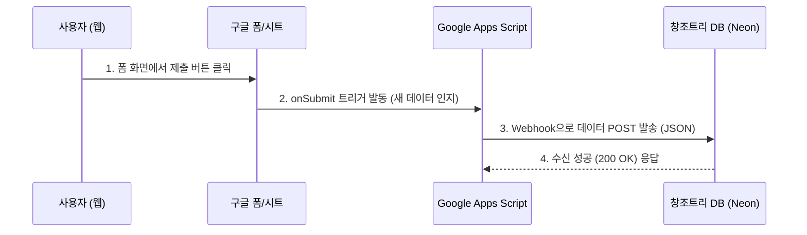

# 아키텍처 설계서: 구글 드라이브 Headless CMS (Phase 1 기준)

- **작성일**: 2026-03-06
- **상태**: 설계(Design)

## 1. 아키텍처 개요 (Phase 1: 폼 데이터 동기화)

구글 시트(설문지 응답지)에 새 행(Row)이 추가될 때, 해당 정보를 창조트리(Neon) DB로 안전하게 중계하는 파이프라인 설계입니다.


*(참고: Phase 3로 넘어갈 때는 User -> Neon DB -> GAS 순으로 흐름이 반전됩니다.)*

## 2. 컴포넌트 상세 설계

### 2.1. 백엔드 (Express API)
- **Endpoint**: `POST /api/webhook/google-sync`
- **로직**:
  - 보안을 위해 Headers에 커스텀 Secret Key (ex. `x-google-sync-token`) 확인.
  - Body로 넘어온 JSON 데이터를 파싱 (이름, 전화번호, 신청강좌 등).
  - Drizzle ORM을 통해 `form_submissions` (신규) 테이블 또는 기존 회원 정보 등에 `INSERT ON CONFLICT DO UPDATE` 처리.

### 2.2. 데이터베이스 스키마 확장 (Neon)
새로운 테이블 `form_submissions`를 생성하거나, 기존 사용자 신청 이력 테이블을 활용합니다.

```typescript
// 제안: schema.ts
export const formSubmissions = pgTable("form_submissions", {
    id: serial("id").primaryKey(),
    googleRowIndex: integer("google_row_index").notNull(), // 구글 시트에서의 행 번호 (추적용)
    formId: text("form_id").notNull(), // 어떤 강좌/설문인지 식별 (기존 매뉴얼의 googleFormId와 연결)
    submittedData: jsonb("submitted_data").notNull(), // 설문 응답의 유연한 저장을 위해 JSONB 채택
    createdAt: timestamp("created_at").defaultNow().notNull(),
});
```

### 2.3. Google Apps Script (GAS) 설계
- **이벤트 트리거**: 스프레드시트의 `onFormSubmit` (폼 제출 시 이벤트) 사용.
- **Payload 구조 설계**:
  ```json
  {
    "formId": "1xBafZ...",
    "rowIndex": 5,
    "timestamp": "2026-03-06T10:00:00Z",
    "data": {
       "이름": "홍길동",
       "연락처": "010-1234-5678",
       "옵션선택": "옵션 1"
    }
  }
  ```

## 3. 에러 핸들링 및 예외 처리
- **네워크 오류 시**: GAS 측 로직에 `try-catch` 및 지수 백오프(재시도) 로직을 삽입하여, 한 번의 트래픽 에러로 데이터가 누락되는 것을 막습니다. (최대 3회 재시도)
- **수동 동기화 경로**: 만약의 장애를 대비하여 창조트리 관리자 페이지에 **"신청 데이터 강제 업데이트(Pull)"** 버튼을 만들어, 1번 버튼 클릭 시 누락된 모든 시트 데이터를 강제로 긁어오도록 REST API를 뚫어놓습니다.
